# 🏗️ Findly - Visuele Architectuurkaart

## 📊 **Systeem Overzicht**

## 🔄 **Data Flow Diagram**

## 🏛️ **Modulaire Architectuur**

## 🗄️ **Database Schema**

## ⚡ **Performance Architecture**

## 🔐 **Security & Rate Limiting**

```mermaid
graph LR
    subgraph "🛡️ Security Layers"
        A[Input Validation]
        B[Rate Limiting]
        C[Error Handling]
        D[Logging & Monitoring]
    end
    
    subgraph "📊 Rate Limiting Strategy"
        E[IP-based Limits]
        F[User-based Limits]
        G[Endpoint-specific Limits]
        H[Time Window Management]
    end
    
    subgraph "🔍 Monitoring & Alerting"
        I[Anomaly Detection]
        J[Performance Alerts]
        K[Security Alerts]
        L[Capacity Planning]
    end
    
    A --> B
    B --> C
    C --> D
    
    E --> I
    F --> J
    G --> K
    H --> L
```

## 🚀 **Deployment Architecture**

```mermaid
graph TB
    subgraph "🌐 Production Environment"
        A[Load Balancer]
        B[API Servers]
        C[Background Workers]
        D[Redis Cluster]
        E[PostgreSQL Cluster]
    end
    
    subgraph "📊 Monitoring Stack"
        F[Prometheus]
        G[Grafana]
        H[Alert Manager]
        I[Log Aggregation]
    end
    
    subgraph "🔧 CI/CD Pipeline"
        J[GitHub Actions]
        K[Automated Testing]
        L[Security Scanning]
        M[Deployment]
    end
    
    A --> B
    B --> C
    B --> D
    B --> E
    
    B --> F
    F --> G
    F --> H
    B --> I
    
    J --> K
    K --> L
    L --> M
    M --> A
```

## 📈 **Scalability Strategy**

## 🎯 **Key Performance Indicators (KPIs)**

| Metric | Target | Monitoring |
|--------|--------|------------|
| **Response Time** | < 200ms | Prometheus + Grafana |
| **Cache Hit Ratio** | > 80% | Redis Metrics |
| **Error Rate** | < 1% | Error Tracking |
| **Throughput** | > 1000 req/s | Load Testing |
| **Availability** | > 99.9% | Health Checks |
| **Search Accuracy** | > 95% | A/B Testing |

## 🔧 **Technologie Stack**

### **Backend**
- **FastAPI** - High-performance web framework
- **SQLAlchemy** - ORM for database operations
- **PostgreSQL + pgvector** - Vector database
- **Redis** - In-memory caching
- **OpenAI API** - Embedding generation

### **Frontend**
- **React + TypeScript** - Modern UI framework
- **Tailwind CSS** - Utility-first styling
- **Shadcn/ui** - Component library
- **Vite** - Fast build tool

### **DevOps & Monitoring**
- **Prometheus** - Metrics collection
- **Grafana** - Visualization dashboard
- **Pytest** - Testing framework
- **GitHub Actions** - CI/CD pipeline

### **Performance & Reliability**
- **Async I/O** - Non-blocking operations
- **Background Tasks** - Heavy operations
- **Rate Limiting** - API protection
- **Error Handling** - Graceful failures

---

**🏗️ Deze architectuur zorgt voor:**
- ⚡ **Hoge performance** door async operaties en caching
- 🛡️ **Betrouwbaarheid** door error handling en monitoring
- 📈 **Schaalbaarheid** door modulaire opzet
- 🔍 **Observability** door uitgebreide metrics
- 🧪 **Kwaliteit** door comprehensive testing 