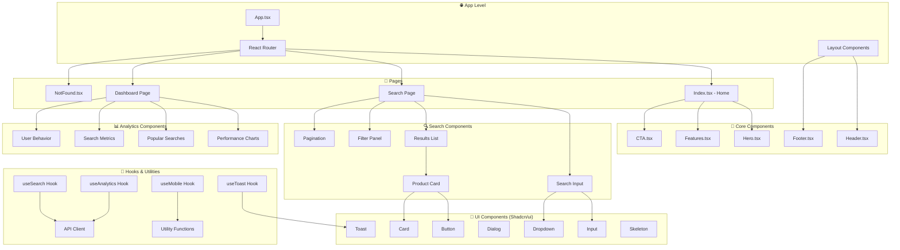
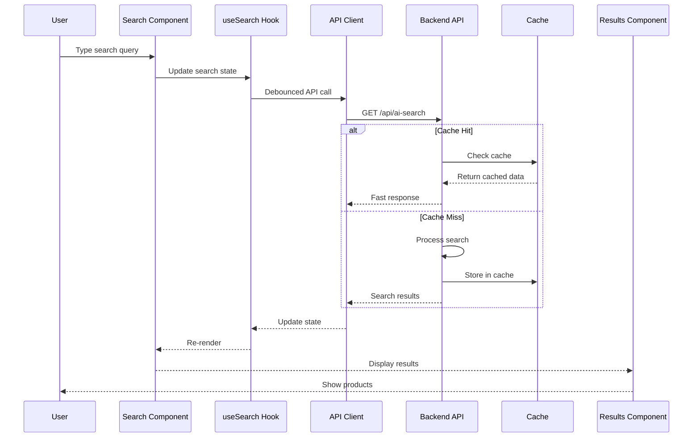
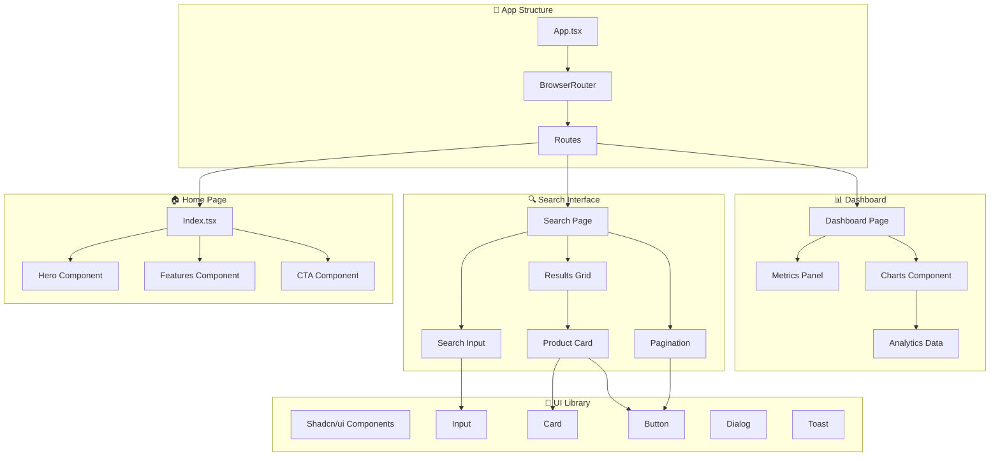
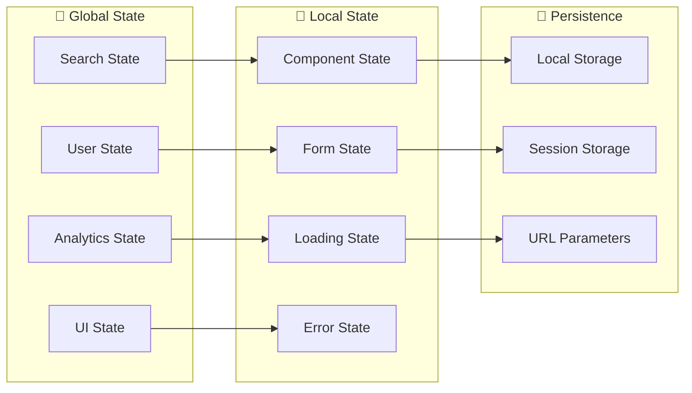
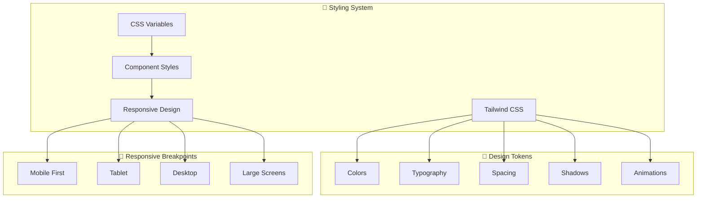
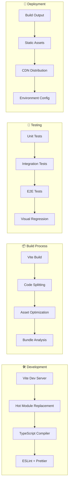
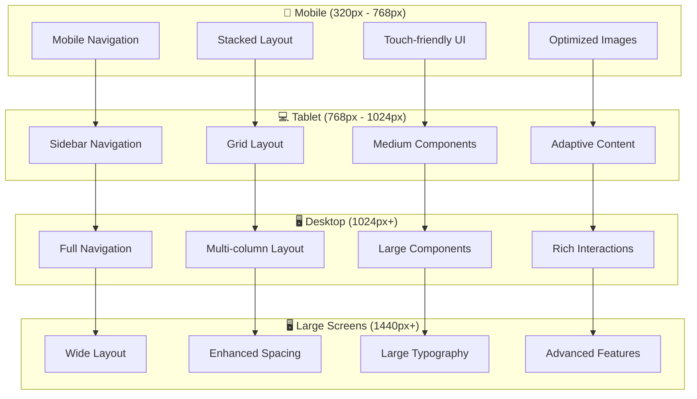
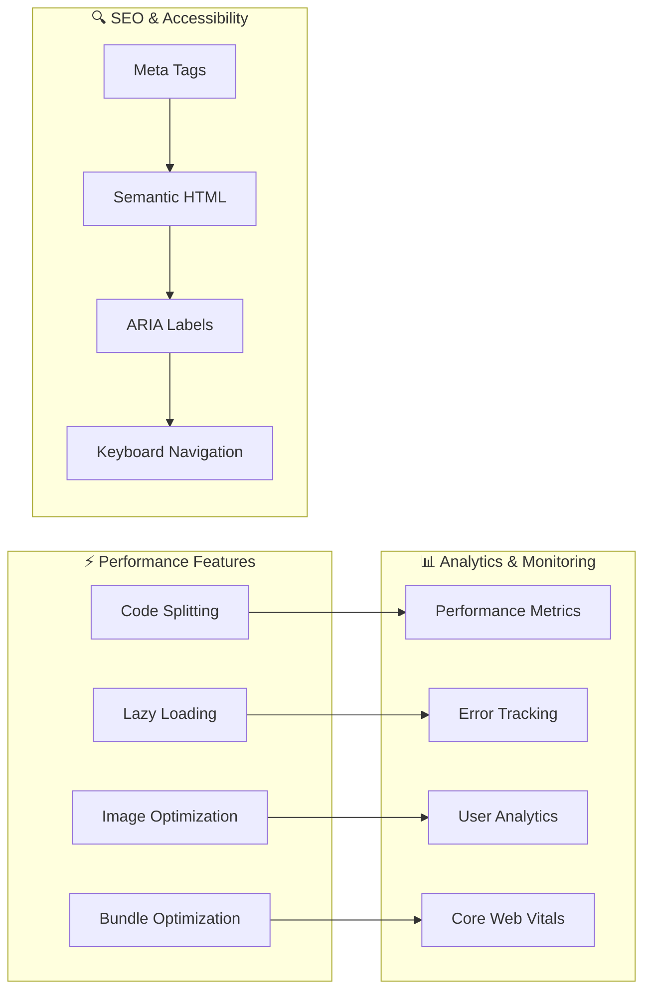

# 🎨 Findly Frontend - Visuele Architectuur

## 🏗️ **Frontend Component Architectuur**

## 🔄 **Data Flow in Frontend**

## 🎨 **Component Hierarchy**

## 🎯 **State Management**

## 🎨 **Styling Architecture**

## 🔧 **Build & Development**

## 📱 **Responsive Design Strategy**

## 🎯 **Performance Optimization**

## 🎨 **Design System**

| Component | Variants | States | Usage |
|-----------|----------|--------|-------|
| **Button** | Primary, Secondary, Ghost, Outline | Default, Hover, Active, Disabled | Actions, Navigation |
| **Input** | Text, Search, Number, Email | Default, Focus, Error, Success | Forms, Search |
| **Card** | Default, Elevated, Interactive | Default, Hover, Selected | Product Display |
| **Dialog** | Modal, Drawer, Popover | Open, Closed, Loading | Confirmations, Details |
| **Toast** | Success, Error, Warning, Info | Show, Hide, Auto-dismiss | Notifications |

## 🚀 **Key Features**

### **🔍 Search Experience**
- **Real-time search** met debouncing
- **Autocomplete suggestions**
- **Search history**
- **Advanced filters**
- **Sorting options**

### **📊 Analytics Dashboard**
- **Search performance metrics**
- **Popular search terms**
- **User behavior insights**
- **Real-time data updates**

### **🎨 Modern UI/UX**
- **Responsive design** voor alle devices
- **Dark/Light mode** support
- **Smooth animations**
- **Accessibility compliant**

### **⚡ Performance**
- **Fast loading** met code splitting
- **Optimized images** en assets
- **Efficient state management**
- **Minimal bundle size**

---

**🎨 Deze frontend architectuur zorgt voor:**
- 🚀 **Snelle performance** door optimalisaties
- 📱 **Responsive design** voor alle devices
- 🎯 **Gebruiksvriendelijkheid** door moderne UI/UX
- 🔧 **Onderhoudbaarheid** door modulaire opzet
- 🧪 **Testbaarheid** door component isolation 